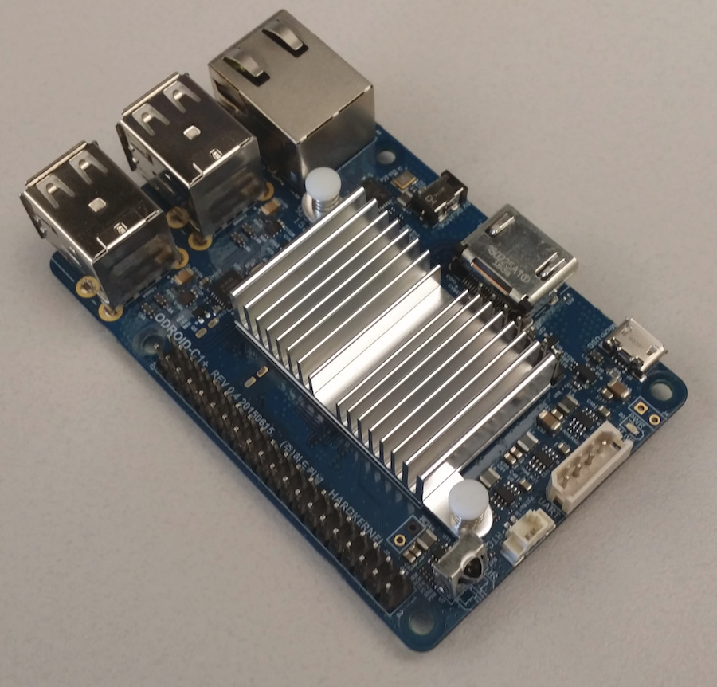
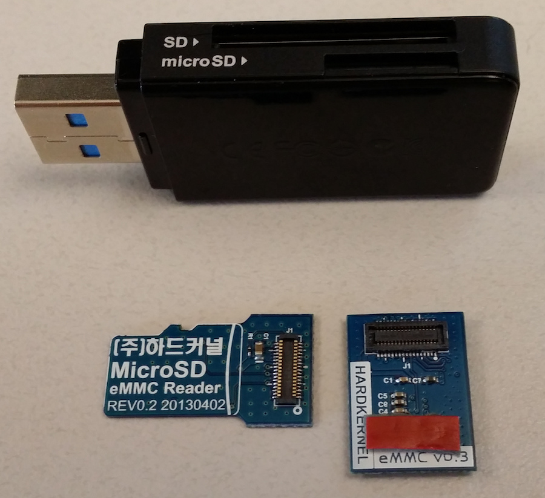
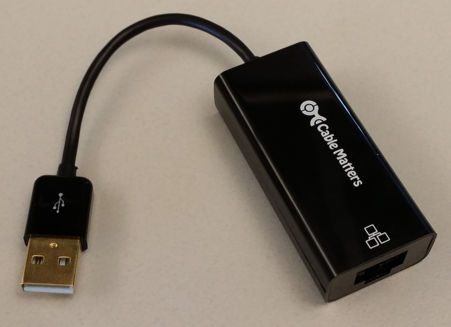
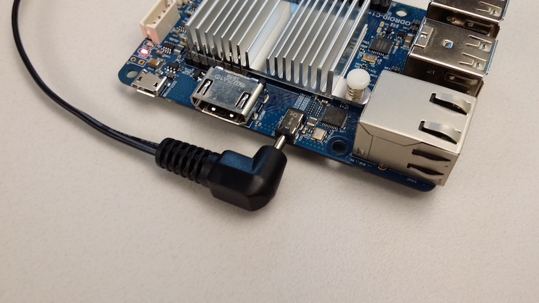
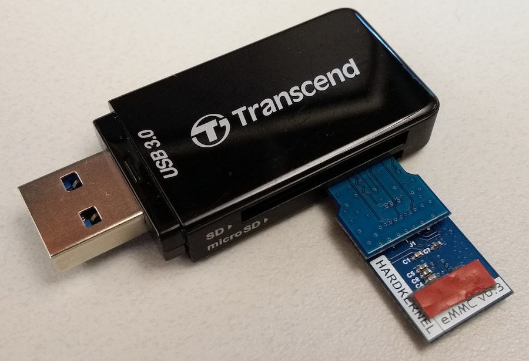
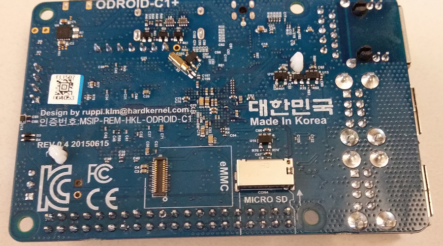
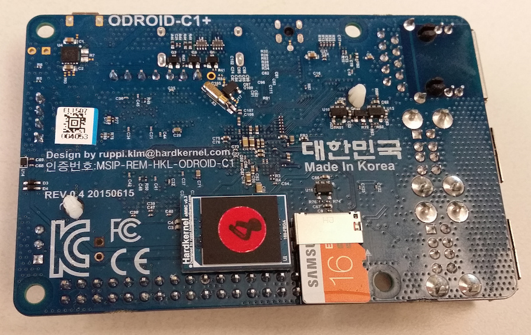
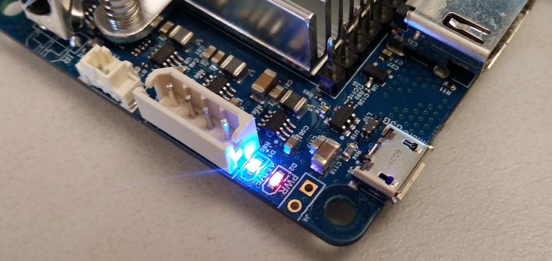
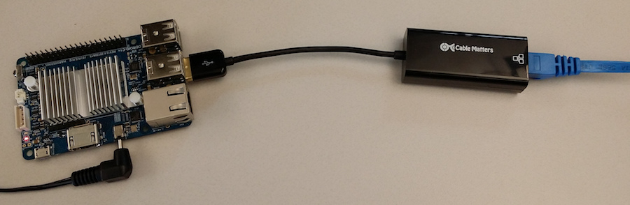

# Getting started guide

This guide explains how to set up a nodecontroller and send sensor data to a beehive server.


## Hardware requirements
The following hardware is needed to setup up the waggle node controller.

* ODROID-C1+

   
   
   A low-cost single board computer with an 1.5Ghz quad core ARM processor and 1GB RAM. More technical details can be found on the manufacturer website:
   
   [ODROID C1+ technical details](http://www.hardkernel.com/main/products/prdt_info.php?g_code=G143703355573&tab_idx=2)
   

* eMMC memory card and USB SD-card adapter

   

   Since eMMC's do not have a standardized connector, Hardkernel eMMC's come with an eMMC module reader with a standard microSD card connector.

* micro SD-card

   

* USB network adapter

   

   A USB 2.0 to ethernet network adapter.

* Power adapter with barrel plug

   

   Specification: 5V 2A DC input

## Prepare eMMC memory cards

To use the node controller you need to copy the waggle image (a modified ubuntu) onto an eMMC memory card. To connect the eMMC with your computer, connect the eMMC with the eMMC/microSD adapter and plug that into a common microSD/USB adapter which in turn can be plugged into the USB port of a computer:



Please follow these instructions to copy the waggle image onto the eMMC memory card: [copy_waggle_image_to_memory_card.md](./copy_waggle_image_to_memory_card.md)

The SD-card does not need a copy of the waggle image. The waggle software on the eMMC will later automatically reconfigure the SD-card.

Once the eMMC memory has copy of the waggle image, both memory cards can be plugged into the ODROID. You can find both memory card slots on the bottom side of the ODROID. 



The final result should look like this:



## Turn on the node controller

The ODROID does not have a power button. Once you plug in the barrel power plug the device will try to boot an OS from the eMMC (or from SD-card if the eMMC is missing).


Note that the ODROID has two LED's. The red "PWR" LED indicates that the device has power. The blue "ALIVE" can indicate three different states (copied from the ODROID C1+ user manual):
* Is on (solid light) when the bootloader is running (Takes a few seconds)
* Blinks slowly when the kernel is running, like a heartbeat (Normal mode)
* Blinks quickly when the kernel is in panic mode

Both LED's activated:



## Connect to the node controller

### Ethernet
The ethernet port on the ODROID currently is reserved for an extension node (or "guest node") and thus has a static IP address assigned. To connect the node controller with your network use the USB network adapter. 



Instructions how to find the IP address of the node controller in your network and to login into the device using ssh can be found here:

[SSH_connection.md](./SSH_connection.md)

### Wireless adapter
TODO

### External monitor and keyboard
If you want, you can use the HDMI connector on the ODROID to connect an external monitor and the USB ports to connect a keyboard. This should not be needed, especially for waggle users, but can be helpful for debugging if you are unable to establish an ssh connection.

## Configure node controller software

_Security note_: The waggle images come with default password "waggle" for both root and user "waggle". To avoid unsolicited access to the node, please change the passwords using the linux command "passwd":

```bash
passwd root
passwd waggle
passwd <user> # in case you are not using the waggle image
```

As root user, specify the beehive sever IP address or URL and run the configure script.

```bash
cd /usr/lib/waggle/nodecontroller
BEEHIVE_HOST=<ip>
./configure
```

For more details see the node controller [README.md](../nodecontroller/README.md).


## start/configure sensor?
Once the configuration is done in nodecontroller, rebooting is recommended, as root user.

```bash
reboot
```

After the rebooting, log into nodecontroller using ssh again.

Manage service:

```bash
waggle-service list
```

You should see the list of status of waggle services, looks similar like:

```bash
+---------------------------+--------+-----------+
| name                      | goal   | state     |
|---------------------------+--------+-----------|
| waggle-epoch              | start  | running   |
| waggle-reverse_ssh_tunnel | start  | post-stop |
| waggle-init               | start  | post-stop |
| waggle-communications     | stop   | waiting   |
| waggle-heartbeat          | start  | running   |
| waggle-wagman             | start  | running   |
| waggle-data_cache         | stop   | waiting   |
+---------------------------+--------+-----------+
```

According to the list shown, nodecontroller is working in terms of maintenance. However, communication modules to beehive server have not been started.

Now, you will use ssh again to access extension_node from nodecontroller (make sure that nodecontroller and extension_node are connected via lan cable.

```bash
ssh waggle@extensionnode
```
Once logged in, configure extension_node using root user:

```bash
cd /usr/lib/waggle/plugin_manager
./configure
```


TODO: add sensor ?

## view results from server
TODO: results from our server or user server ?


