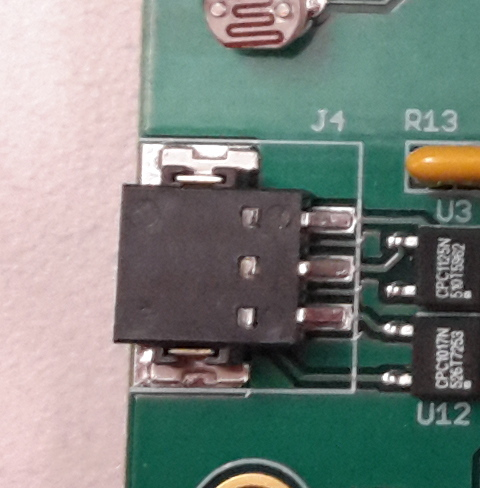
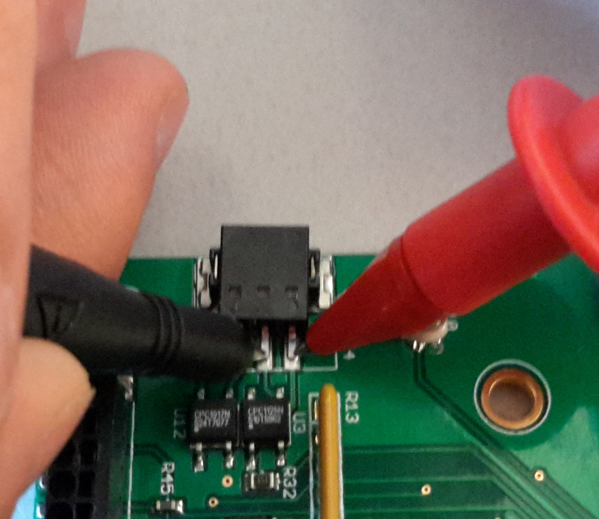

# Test Scope and Coverage

This test evaluates the following aspects of Wagman system design.  
*   The ability to connect the appropriate boot-pins of the XU4 toward
    changing the primary boot-up media.  

*   Default boot media must be uSD, which is achieved by connecting pins 1 and 2 of the boot selector port (J4).
 

# Test Setup Procedure

*This test requires additional equipment. A multi-meter with continuity test capability in audible beep mode
to signify continuity is required.*

## Test Events Timeline
* The test starts with a Wagman that is not connected to power or the QA computer.
* Wagman is loaded with firmware and the toggling ability is tested.

## Electrical Connection
*  Connect micro-USB cable between Wagman's J3 and QA computer.
*  Connect 5V DC power to Wagman.

__Please make sure only the Wagman under test is connected to the QA computer. No other Wagman or Arduino Micro/derivatives can be connected at this time.__

## Testing Procedure
*   On an unpowered Wagman that is not connected to the QA computer, check the continuity between pins 1 and 2 of J4.  

*   Next check the continuity between pins 2 and 3 of J4. 

*   Connect the Wagman to QA computer and power it ON. 
*   Start the second phase of the test by issuing the command *make test* in the Wagman subfolder
    and follow the on-screen prompts.

    __To exit the screen session created for the test, press Control+a, followed by k and y.__

## Test Log
This test is evaluated and scored on the __Wagman QA Scoresheet__..

# Success Criteria
The test is considered __PASSED__ if all the subtests under the Wagman XU4 Boot Selector Test pass.

