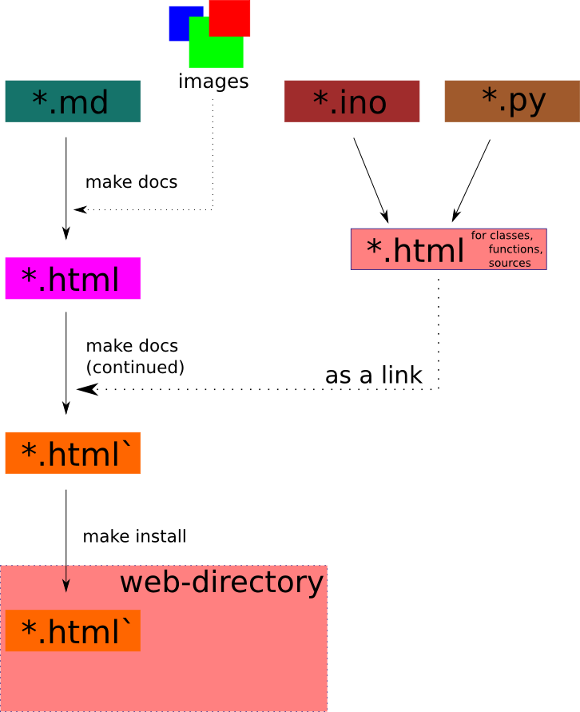

<!--
waggle_topic=IGNORE
-->

# Documentation for web publishing

Web pages that describe about Waggle are necessary in order to provide information of the latest stable version of Waggle to users. Github markdown files placed in our github repositories are used to generate such web pages. This means that contents of the web pages come from the corresponding markdown files. This allows developers to maintain their web site by just editing the markdown files and compiling them to make updated web pages.

 <br>

## Generate html files

In order to make web pages, a file list should be updated and checked. The file list is named 'file-list.txt' and located under __'res'__ folder and contains pairs of links between the paths of a markdown file and the corresponding web page. For example, __'index.html:index.md'__ (':' is delimiter) describes that __'index.html'__ is the source of __'index.md'__. If one of the links or pairs changed in git repositories, it must be updated in the file list before compilation.

To generate html files use:

```bash
make docs
```

To clean all generated html files under this web folder use:

```bash
make clean
```

In order to publish the generated html files along with the images, set up a variable called __'INSTALL_URL'__. The variable must contain remote address of the destination and location where all the files will be transferred. An example of the correct URL would be:

```bash
export INSTALL_URL=remote_user_name@remote_address:where/html/files/go # in linux
```

After the variable is set use:

```bash
make install
```
This process requires you to put the password for 'remote_user_name'. Now the web directory (waggle_web as default) is in the remote address under the path set in INSTALL_URL variable.

## Linking programming snippets (python scripts / c) to html files

If an html file needs technical support such as code snippets, the corresponding md file can include a link to the code file. The make supports in-text reference using links. Below is an example in an markdown file:

```
... This is the code you may need to check [The code](path/to/the/code.py). ...
```

In the example, an API document for 'code.py' will be generated using doxygen along with doxypy. And then, the document will be linked in the text of the md file. The API document lists formatted classes, functions, variables of the code and also provides the actual code.

## Including hand-crafted html files

If a han-crafted html needs to be added to the documentation, simply update the file-list with the pair of the link for the html file and put the html file in a place where makefile can find. Below is an example of the file-list:

```
....
payloads/sensors/SensorTable.html:user_documentation/sensors/SensorTable.html
....
```

SensorTable.html file is now placed under user_documentation/sensors and will be transferred to payload/sensors. All linked images which use relative link will also be copied to Img folder. Make sure that the extension is html, not md so that makefile does not attempt to convert it.

## Deverloper notes

* pandoc uses style.css under __'res'__ folder, which has MIT license.
* doxygen uses doxygen.css under __'res'__ folder, which has GNU GENERAL PUBLIC LICENSE.
* All images that have relative links and used in the markdown files will be copied into __'ROOT_WEB_DIR/Img'__.
* Relative links for other web pages (shown only in the file list) or images are re-routed using the path of html files while absolute links remain untouched.
* Further information about compilation can be found at [Pandoc](http://pandoc.org)
