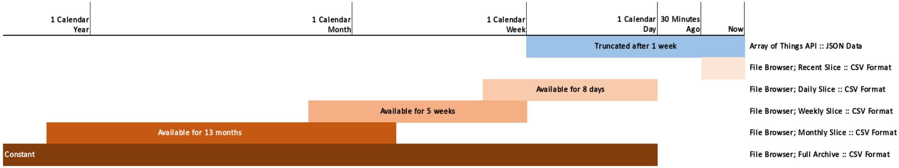

<!--
waggle_topic=/data_analysis/datasets,"Sensor Datasets"
-->

# Bulk Sensor Datasets

Data from Waggle-based sensor nodes (AoT nodes, Waggle uglyboxes, Nano-Waggle lightweight sensors) are available for download and analysis. 

Data ([ontology](https://github.com/waggle-sensor/beehive-server/blob/master/publishing-tools/projects/AoT_Chicago.complete/sensors.csv)) is assembled and exported daily, and made available via an archive published every day at midnight CST.  

# Where do I get Array of Things Data in other forms?

There are two applications available to access AoT data:

1. [The AoT File Browser](https://aot-file-browser.plenar.io/) to download bulk volumes of data
2. [The AoT API](https://api-of-things.plenar.io/) to programmatically access _recent_ data

The following chart illustrates the data availability across all the AoT applications - 



## Archive Format

Waggle-based nodes used by several projects, so archives are organized by Waggle *ProjectID*.  Each archive is stored as a single [tar](https://en.wikipedia.org/wiki/Tar_(computing)) file. 

Files in the archive use this naming convention:

```
<ProjectID>.latest.tar
```

Untarring an archive will create a date-specfic directory:

```    
<ProjectID>.YYYY-MM-DD
```

Here, YYYY-MM-DD is the UTC date when the tar archive was produced. 

Inside the archive directory are the following files:

```
data.csv.gz	# compressed file of all data values
nodes.csv	# list of nodes in the dataset and their metadata
README.md	# An explaination of the database fields 
sensors.csv	# A list of sensors and their metadata
provenance.csv	# Metadata on the entire dataset archive
offsets.csv     # data.csv.gz file byte offsets
```

The sensor data is compressed, and must be uncompressed to be used.  It will expand roughly 10X in size after being uncompressed.

All data is stored in [CSV](https://en.wikipedia.org/wiki/Comma-separated_values) format.

## Available Datasets: 

Several datasets split based on projects are available at this [link](http://www.mcs.anl.gov/research/projects/waggle/downloads/datasets/index.php).

## Usage Example 

1. Download the archive - 
```
$ wget http://www.mcs.anl.gov/research/projects/waggle/downloads/datasets/AoT_Chicago.complete.latest.tar
```

2. Untar the archive - 
```
$ tar -xf AoT_Chicago.complete.latest.tar
```

3. It should produce a directory - 
```
$ ls 
AoT_Chicago.complete.2018-05-22
AoT_Chicago.complete.latest.tar

```

4. Explore the README and other meta information - 
```
$ cd AoT_Chicago.complete.2018-05-22
$ ls 
data.csv.gz nodes.csv  provenance.csv   README.md  sensors.csv 
```

5. When ready, unpack the data archive. The archive decompressess to a 
CSV text file about 10 times its size -  

```
$ gzip -d --keep data.csv.gz
$ ls 
data.csv data.csv.gz nodes.csv  provenance.csv   README.md  sensors.csv 
```

# Working with the Data
We have a few simple tools for to manipulate, extract, create convenient data products and analyze (plot) data. These 
tools can be found in the [Waggle data-tools](https://github.com/waggle-sensor/data-tools) repository. 
