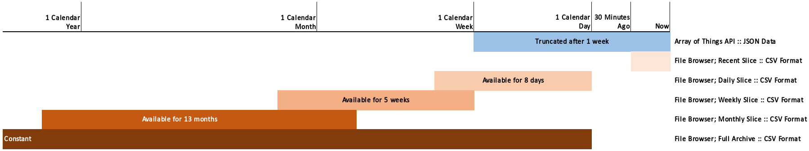

# Where do I get Array of Things Data?

There are two applications available to access AoT data:

1. [The AoT File Browser](https://aot-file-browser.plenar.io/) to download bulk volumes of data
2. [The AoT API](https://api-of-things.plenar.io/) to programmatically access _recent_ data

The following chart can be used to illustrate when data is available and from which application.

