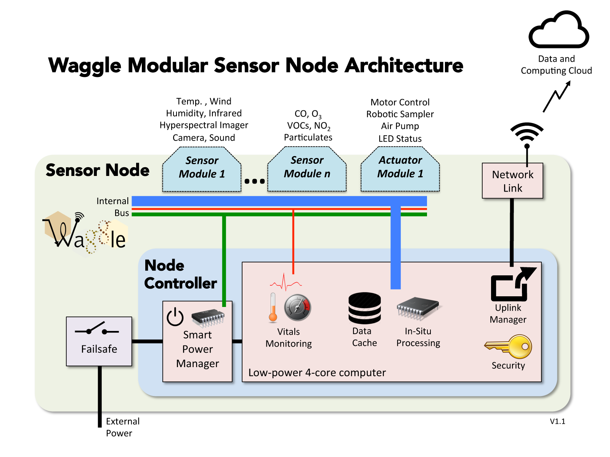

<!--
waggle_topic=/nodes/introduction, Waggle Architecture
-->

# Waggle Architecture:
Waggle has a modular and scalable architecture.  Waggle Nodes have several key components:
  * Node Controller: The brain that controls a Waggle node has two components:
    * Low Power SoC: The CPU brains of a Waggle node is a low-power single-board computer (SoC) running Linux.  
    The software on the Node Controller runs a custom system software stack that provide extreme resilience, heath monitoring, a local data cache, and a secure encrypted link back to the cloud data storage servers (the beehive).
    * System Management Board: Waggle nodes must continue to operate, even under extremely hard environmental conditions.  The System Management board measures power consumption, turns components on and off, and monitors operations.  Misbehaving components can be disconnected or their software modified.
  * Sensor/Actuator Module: Individual sensors can be grouped into a modular sensor board.  A Waggle node can support several sensor modules or actuators (motor controls, sampling devices, etc).  Our standard sensor module measures dozens of key environmental values. Other sensor boards under evaluation include ones that measure NO2 (Nitrogen Dioxide), O3 (Ozone), CO (Carbon Monoxide), SO2 (Sulfer Dioxide), and H2S  (Hydrogen Sulfide).
  * Network Links: Waggle supports Wifi or cellphone based data networks.  A secure encrypted link allows each Waggle node to quickly push data into the cloud.

__The Waggle Node Architecture. The Node Controller is the heart of the system ---__

__Of course after a Waggle node sends it’s data up to the cloud, it needs processing and publishing ---__

