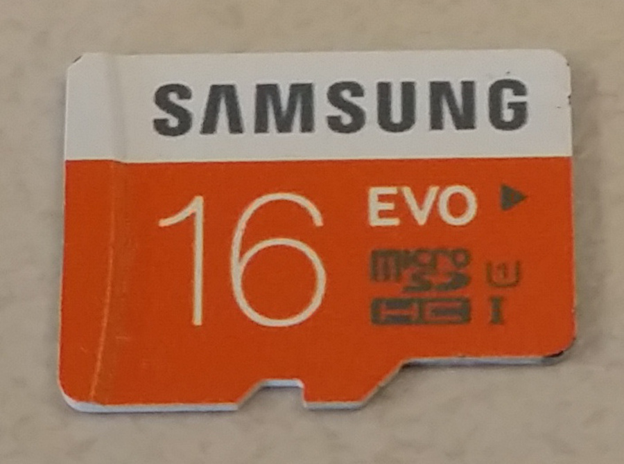
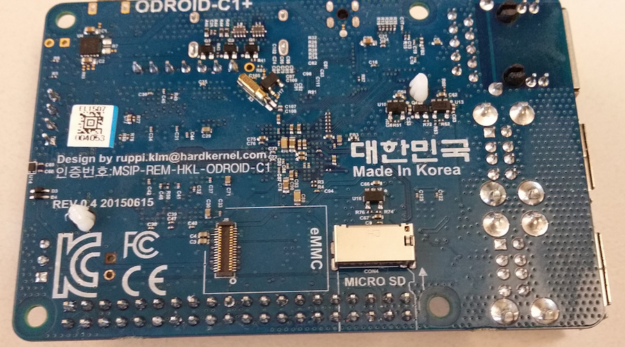
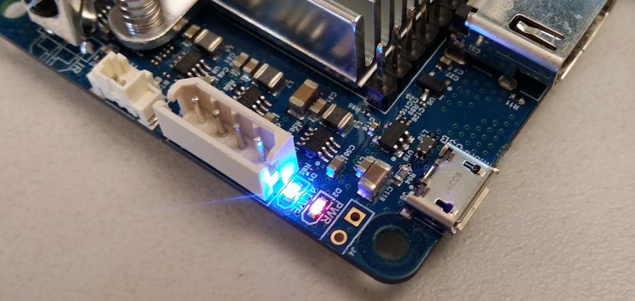

# Getting started guide

This guide explains how to set up a nodecontroller and send sensor data to a beehive server.


## Hardware requirements
The following hardware is needed to setup up the waggle node controller.

* ODROID-C1+

   
   
   A low-cost single board computer with an 1.5Ghz quad core ARM processor and 1GB RAM. More technical details can be found on the manufacturer website:
   
   [ODROID C1+ technical details](http://www.hardkernel.com/main/products/prdt_info.php?g_code=G143703355573&tab_idx=2)
   

* eMMC memory card and USB adapter

   

* micro SD-card

   

* USB network adapter

   
   

* Power adapter with barrel plug

   Specification: 5V 2A DC input

   


## Prepare eMMC memory cards

To use the node controller you need to copy the waggle image (a modified ubuntu) onto an eMMC memory card. Since eMMC's do not have a standardized connector, Hardkernel eMMC's come with an eMMC module reader with a standard microSD card connector. The microSD card connector can then be plugged into a normal microSD/USB adapter which in turn can be plugged into the USB port of a computer:


Please follow these instructions to copy the waggle image onto the eMMC memory card: [copy_waggle_image_to_memory_card.md](./copy_waggle_image_to_memory_card.md)

The SD-card does not need a copy of the waggle image. The waggle software on the eMMC will later automatically reconfigure the SD-card.

Once the eMMC memory has copy of the waggle image, both memory cards can be plugged into the ODROID. You can find both memory card slots on the bottom side of the ODROID. 



The final result should look like this:


## Turn on the node controller

The ODROID does not have a power button. Once you plug in the barrel power plug the device will try to boot an OS from the eMMC (or from SD-card if the eMMC is missing).


Note that the ODROID has two LED's, the red "PWR" that indicates power, and the blue "ALIVE", which will start to blink once the device has successfully booted.



## Connect to the node controller

### Ethernet
The ethernet port on the ODROID currently is reserved for an extension node (or "guest node") and thus has a static IP address assigned. To connect the node controller with your network use the USB network adapter. 

TODO: picture of USB network adapter connected

Instructions how to find the IP address of the node controller in your network can be found here:

[./copy_waggle_image_to_memory_card.md#ssh-connection-with-odroid](copy_waggle_image_to_memory_card.md#ssh-connection-with-odroid)

### Wireless adapter
TODO

### External monitor and keyboard
If you want, you can use the HDMI connector on the ODROID to connect an external monitor and the USB ports to connect a keyboard. This should not be needed, especially for waggle users, but can be helpful for debugging if you are unable to establish an ssh connection.

## Configure node controller software

As root user, specify the beehive sever IP address or URL and run the configure script.

```bash
cd /usr/lib/waggle/nodecontroller
BEEHIVE_HOST=<ip> ./configure
```

## start/configure sensor?
TODO: add sensor ?

## view results from server
TODO: results from our server or user server ?


