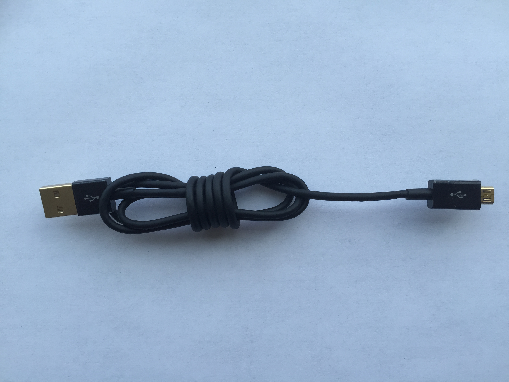
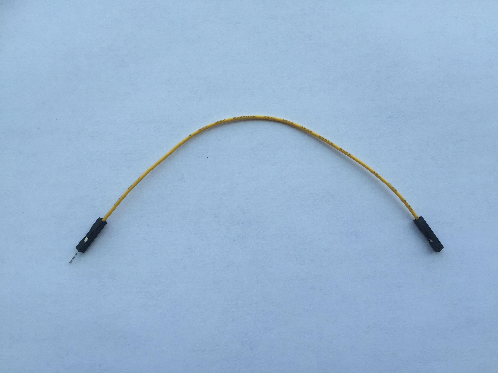
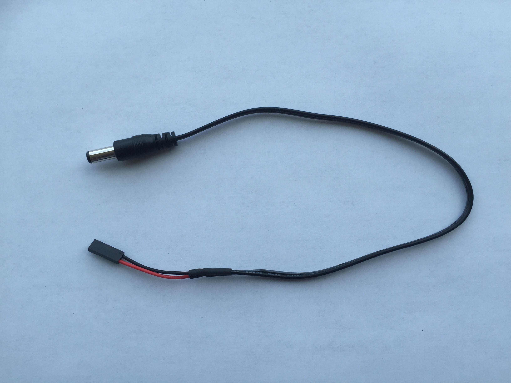
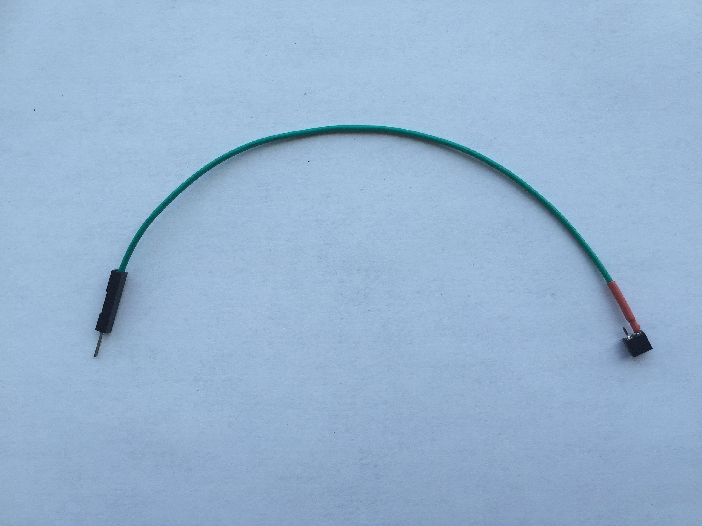
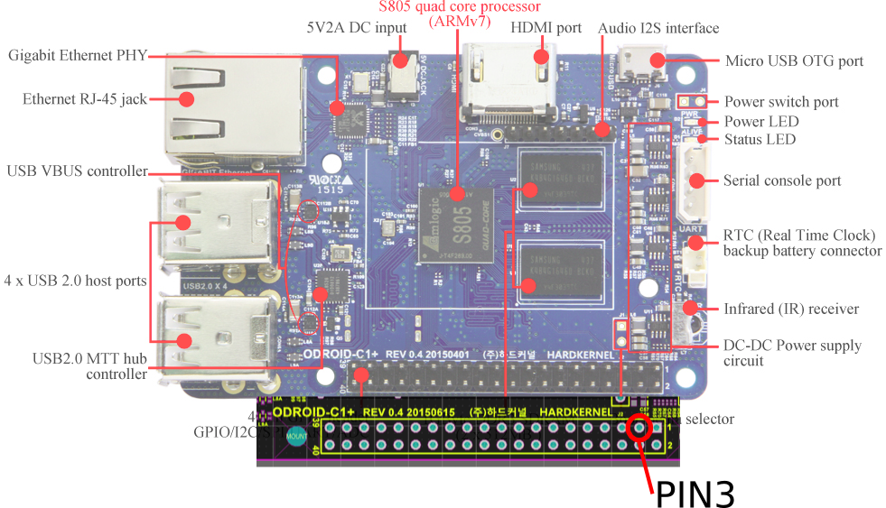
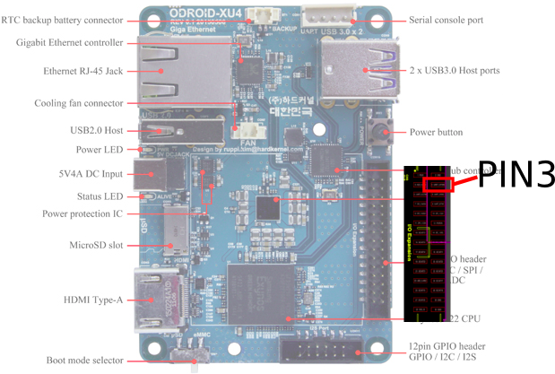
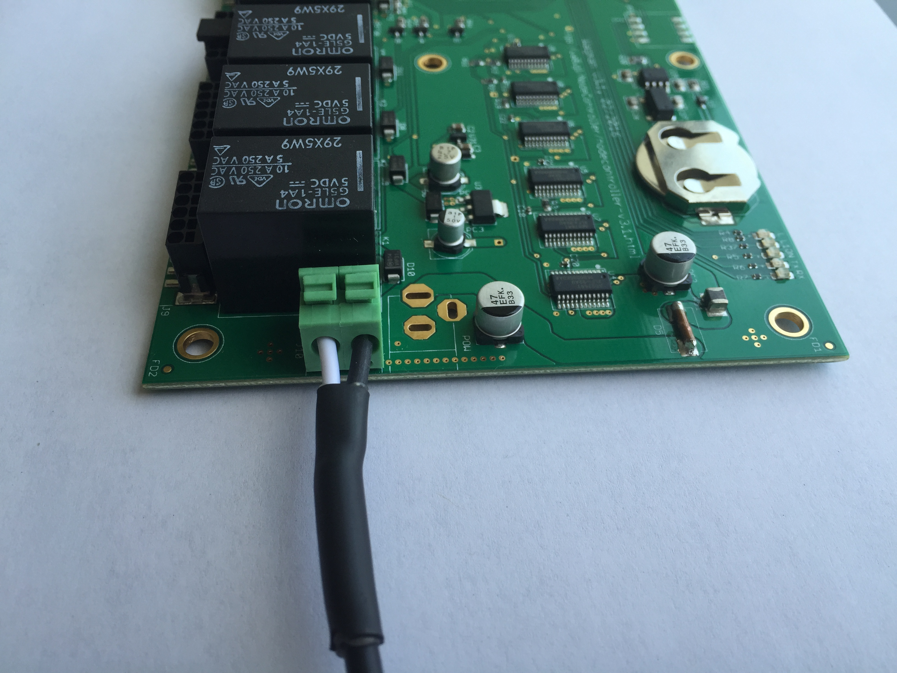

# Set up waggle node
This explains how to set up a waggle node that includes wagman, nodecontroller, and extension_node.

## Parts list
A waggle node consists of following parts:

### Wagman
 * Wagman </br>

 * Power adapter </br>

 * MicroUSB-USB cable </br>


### Nodecontroller
 * Odroid-C1+ </br>

 * Power cable </br>

 * Micro SD card </br>

 * eMMC card </br>

 * Lan cable </br>

 * Ethernet-USB adapter </br>

 * Heart-beat cable </br>

 
### Extension_node
 * Odroid-XU4 </br>

 * Power cable </br>

 * Micro SD card </br>

 * eMMC card </br>

 * Heart-beat cable </br>


## Overall diagram
System diagram is depicted below. 

## Instructions on assembling
1) Connect nodecontroller's power and heart-beat cable to Wagman board. Those cables must be plugged in PORT 1 (Refer to [Wagman] (https://raw.githubusercontent.com/waggle-sensor/waggle/master/wagman/v3/resources/WagmanAnnotated.jpg)). </br>
 </br>
And then, put the power cable to nodecontroller and the heart-beat cable to PIN 3 of nodecontroller. </br>
 </br>
2) Connect extension_node's power cable and heart-beat cable to Wagman board. Those cables must be plugged in PORT 2 (Refer to [Wagman] (https://raw.githubusercontent.com/waggle-sensor/waggle/master/wagman/v3/resources/WagmanAnnotated.jpg)). </br>
 </br>
And then, put the power cable to extension_node and the heart-beat cable to PIN 3 of extension_node.
 </br>
3) Connect lan cable to extension_node with nodecontroller. </br>
 </br>

4) Connect Ethernet-USB adapter to nodecontroller. </br>
 </br>

5) Connect power adapter to Wagman. </br>
 </br>
## Install softwares

### Wagman firmware installation
In order to manage nodecontroller and extension_node, Wagman has to run its management program. Download the latest firmware [here] (black:) to your computer.

Unzip the firmware:

```bash
unzip <file-name>
# if you do not have unzip, install it using sudo apt-get install unzip
```

Install avrdude to upload the firmware:

```bash
sudo apt-get install avrdude
```

Connect microUSB-USB cable to Wagman with the computer.

Run install.sh:

```bash
cd wagman_init
./install.sh
```

### Nodecontroller and extension_node firmware installation

**WARNING: before procceding the following steps, plug off wagman's power adapter.

Follow the instruction [here] (https://github.com/waggle-sensor/waggle/blob/master/user_documentation/copy_waggle_image_to_memory_card.md) to upload the latest version of both nodecontroller and extension_node firmware. As a result, you will have two micro SD cards for both devices, respectively.

Insert each micro SD card on the designated device (nodecontroller firmware for nodecontroller and extension_node firmware for extension_node). eMMC card should also be inserted on both devices.

## Waggle boot-ups

Plug on wagman's power adapter. After a few seconds, 'ALIVE' LED of both nodecontroller and extension_node will be blinking. At the first time of booting the two devices will be rebooting automatically. After re-booting, you should be able to connect to nodecontroller:
[SSH connection.md] (./SSH_connection.md)

And then, follow the instruction:
[Configure nodecontroller] (./getting_started.md#configure-node-controller-software)
