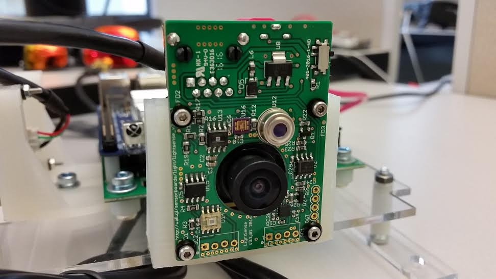
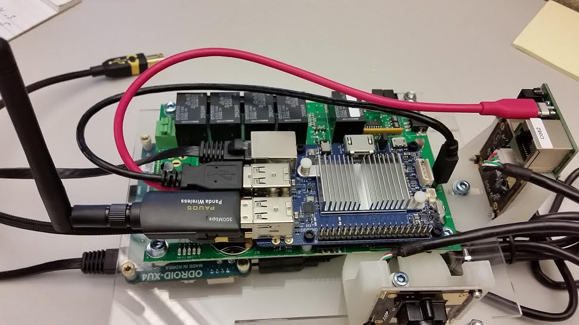
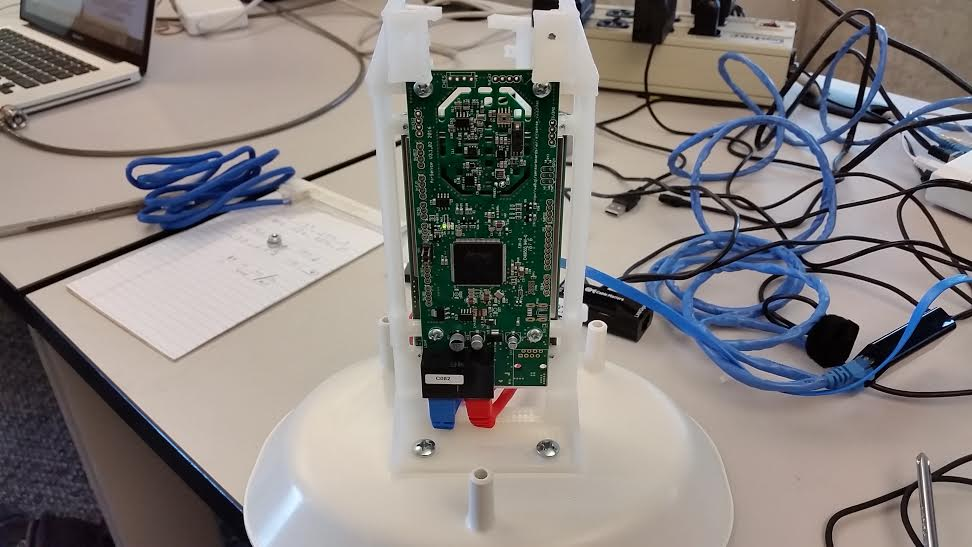

# Ugly Box Build

## The following steps are the quickest way to put together the box:

A) Start by mounting the XU4 to the bottom of the pre-cut board with the M3 screws and SP6 spacers.

 
B) Mount the C1+ to the Wagman board with the M2 screws, SP? spacers and 440 Hex plastic nuts.

C) Mount the Wagman to the pre-cut board on the opposite side of the XU4 using the M4X14, M4 washers, and size 165 spacers.

D) Connect the pre cut board with the two legs using the M4X30, SP134 spacers, and the M4 nuts. 

E) Next, using the pre-cut camera mounts, mount the lightsense on the outside of one of them and the camera on the inside with the S-A2-2X18, M2 washers, and M2 nuts. On the other mount, mount the camera on the outside. To keep the camera mounts in place, use a M4X14, two M4 washers, M4 lockwash, and a M4 nut.

 

F) Steps 1-5 should esentially cover the structure of the node, so next we will wire the node together. You should start by connecting the camera cords to the cameras and then plug the USBs into the XU4. That should be all that is plugged in to the XU4 aside from the ethernet cable from the C1+. 

G) Next, you should have two anker USB cables plugged into the C1+ going to the wagman and the lightsense with the camera. The other two USB slots are used for the wireless card and the connection to the particle sensor. 

H) The last thing for the wiring should be the ethernet cords. You need to connect an ethernet cord from the lightsense to the airsense and one from the airsense to the chemsense. The airsense and chemsense should also be mounted like shown below. After that is done, you should have a complete ugly box wired up. 

