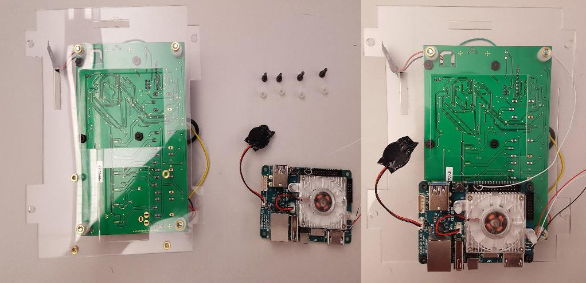
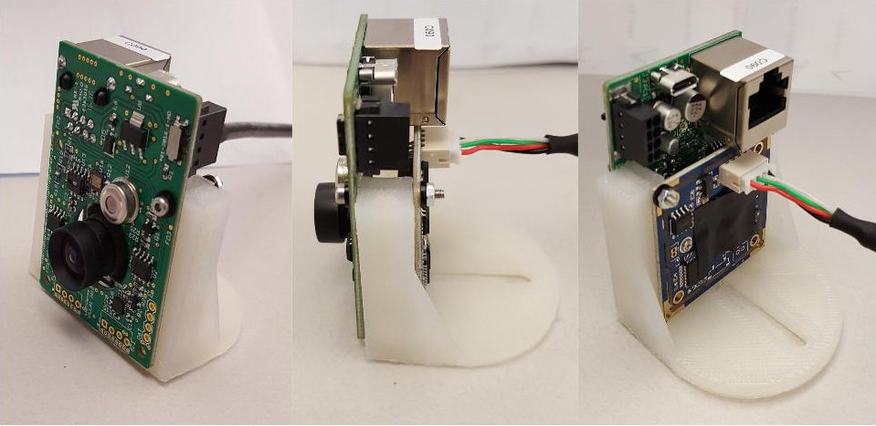
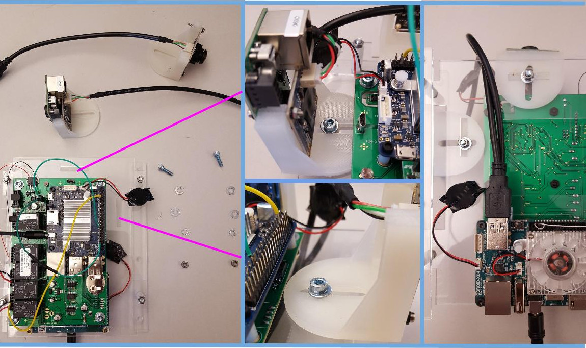
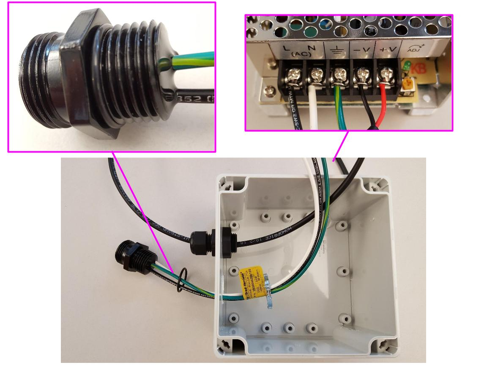
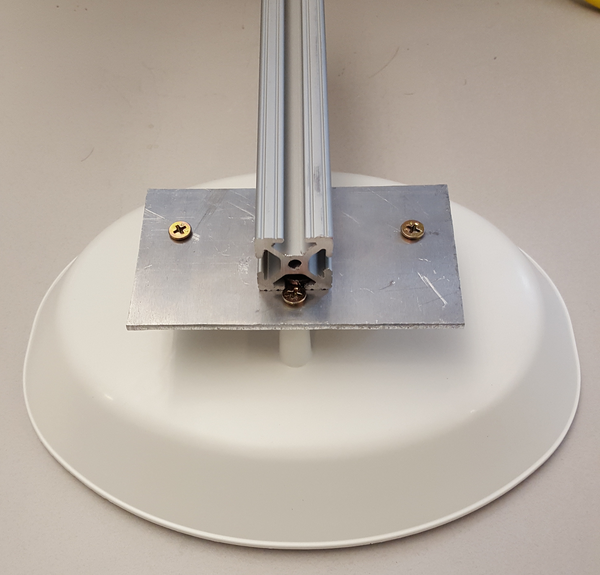

# Ugly Box Build Guide

## Step by step instruction for assembling the Ugly Box

<a href="UBpartindex.html">Part Index</a>

<ol>
<li>
Prepare the Wagman and C1+

<ul>
<li>
 

<li>Using 4 M3x20 screws, 4 440 Hex nuts, and 4 SP3/8 spacers, attach the C1+ to the Wagman. Be sure to line up the header on the C1+ with the pins on the Wagman.
See the top left blow-up in the image above.  

<li>
Connect the green wires from pins 27 and 39 on the C1+ to the SRE. The wire with the resistor can connect to either of the SRE pins. See the bottom left blow-up in the image above.  

<li>
Connect the yellow heartbeat cable from pin 3 on the C1+ to the 4th slot from the left in the J9 port of the Wagman.
Then, connect the C1+ power pigtail to the J9 Wagman port, black wire in the 3rd slot from the left, red wire in the 5th slot from the left.
See the bottom right blow-up in the image above.

<li>
Attach the RTC battery to the C1+ in the RTC port.

</ul>
<li>
Mount the Wagman & C1+ to the acrylic plate.

<ul>

<li>
Using 4 M3x14 screws, 4 SP100 spacers, and 4 M4 washers, mount the Wagman to the acrylic plate. The M3x14 screws will screw into the M3 heatsets in the plate.

<li>
Make sure to mount in the proper position, with retangular camera mount slots in the same corner as the C1+.

<li>
Position the Wagman identical to the right side of the image above.

</ul>

<li>
Mount the XU4 to the acrylic plate.
<ul>

<li>
Using 4 M3x10 screws and 4 SP3/16 spacers, mount the XU4 to the bottom of the acrylic plate.
<li>
Make sure the USB ports on the XU4 face the center of the acrylic plate, ethernet port facing the edge.
<li>
Position the plate and XU4 identical to the right side of the image above.
<li>
Attach the RTC battery to the XU4 in the BT1 / Backup port, right next the the “ODROID XU4” printing.
</ul>
<li>
Attach the acrylic legs.
<ul>

<li>
Using 4 M4x30 phillips screws, 4 SP134 spacers, and 4 M4 hex nuts, mount the legs to the acrylic plate.
The order is as follows: Screw, acrylic leg, spacer, acylic plate, hex nut.
<li>
The holes in the legs are not symmetric, so make sure to attach properly, with the middle hole closest to the XU4. Consult the image above for assitance.
</ul>
<li>
Prepare the Cameras.
<ul>

 

<li>
First, prepare the skyward facing camera, which is combined with the LightSense, using 4 M2x20 screws, 8 M2 nylon washers, and 4 M2 hex nuts.
<li>
The LightSense must be attached to the camera mount first, with the light sensor facing the front of the mount.
Make sure to place a washer between the head of the M2 screw and the LightSense board.
<li>
Attach the BLUE 75 degree camera to the back of the mount, with the lense protruding through the hole in the LightSense board.
Make sure the place washers between the camera board and the hex nut. When attaching, use the outer set of holes on the camera board, not the holes closest to the lense.
<li>
Make sure the connection slot on the camera is closest to the top of the mount, as it is in the image above.
<li>
Plug one of the 8 inch camera cables into the camera (see right portion of image above).
<li>
There is a small switch on the front of the light sense (top right corner of the board in the left portion of the image above). Make sure it is in the DOWN position (down as in closest to the lense of the camera).
</ul>

<ul>

  

<li>
Next, attach the side camera to a mount using 4 M2x20 screws, 4 M2 nylon washers, and 4 M2 hex nuts.

<li>
Attach the BROWN 2.1 mm camera to the front of the camera mount. Make sure to place washers between the head of the screw and the camera board.

<li>
Make sure the connection slot on the camera is closest to the top of the mount, as it is in the image above.

<li>
When attaching, use the outer set of holes on the camera board, not the holes closest to the lense.
</ul>

<ul>

 

<li>
Now, attach the prepared cameras to the acrylic plate, using 1 M4x14 screw, 2 M4 washer, 2 M4 lockwashers, and 2 M4 hex nuts PER CAMERA.
<li>
Attach BLUE camera + LightSense to the top camera mounting slot; reference the top middle section of the image above.
The order of parts is as follows: Screw, Washer, Camera mount, acrylic plate, Washer, Lockwasher, hex nut.
<li>
Next, attach the BROWN camera to the side camera mounting slot; reference the bottom middle section of the image above.
The order of parts is as follows: Screw, Washer, Camera mount, acrylic plate, Washer, Lockwasher, hex nut.
<li>
Finally, run both of the USB camera cables beneath the acrylic plate and connect them to the USB ports on the XU4. See the far right section of the image above.
</ul>

<li>
Connect Cameras and XU4 to Wagman.
<ul>

 

<li>
Connect the power and heartbeat cables to the LightSense. Skipping the bottom slot, attach the wires in the following order, going up: Red, White, Black.
See the top left blow-up in the image above.
<li>
Connect a MicroUSB to USB cable from the LightSense (MicroUSB) to the C1+ (USB).
<li>
Connect a MicroUSB to USB cable from the Wagman (MicroUSB, between the C1+ and the camera+LightSense) to the C1+ (USB).
<li>
Connect the black, white, and red XU4 boot-selector wires to the Wagman. See the bottom left blow-up in the image above for order.
<li>
Connect the LightSense power and heartbeat cables to the Wagman using the J6 Port. Starting at the 3rd slot from the left, the order of wires is Black, White, Red.
See the bottom center blow-up in the image above.
<li>
Connect the XU4 power and heartbeat wires to the Wagman at the J5 Port. Starting at the 3rd slot from the left, the order of wires is Black, White (Thin), Red.
See the bottom center blow-up in the image above.
</ul>

<li>
Prepare Sensors and Shield.

<ul>

 

<li>
First attach the senor mounting frame to the shield base plate.
<li>
Make sure the flat foot of the sensor frame is facing the side with 2 protruding holes. See the image above for reference.
<li>

 

<li>
Using 4 1/4" phillips screws, mount the AirSense to the sensor frame. This board should be facing the two protruding holes in the base plate.
See the left section of the image above.

<li>
Using 4 1/4" phillips screws, mount the ChemSense to the sensor frame. This board should be facing the single protruding hole in the base plate.
See the middle section of the image above.

<li>
(OPTIONAL) Attach the Alphasense to the top of the sensor frame using two M3x10 screws.

<li>
Use a 6" flat black CAT6 cable to connect the AirSense to the ChemSense. Use the RJ45 jack labeled “CHEM” on the AirSense. See the top right blow-up in the image above.
<li>
Make sure the two switches in the ChemSense are in the AUX and ON positions. See the bottom right blow-up in the image above.
<li>
Attach a 3’ flat blue CAT6 cable to the AirSense in the RJ45 jack labeled “LIGHT”. See the top right blow-up in the image above.
The other end will connect to the RJ45 jack on the LightSense.

 

<li>
Finally, finish the shield. First, screw the 3 long rods into the top plate of the shield.
<li>
Stack the 7 shield extenders onto the base plate with sensor frame attached, running the 3’ flat CAT6 cable (and OPTIONAL AlphaSense USB Cable) through each hole.
<li>
Slide the 3 rods into the corresponding holes in the shield extenders. Once through to the bottom, use the 3 wingnuts to secure the shield together at the bottom plate.
<li>
When assembling the shield, make sure the switches on the ChemSense remain in the ON / AUX positions (up / up)! 
<li>
**There may be other (and/or easier) ways to complete this step. Whichever path is chosen, make sure the CAT6 (and optional USB) cables are running out the top of the shield**
</ul>
<li>
Prepare Power Box
<ul>
<li>
Using the 2 M3x10 screws, attach the AC/DC converter to the metal riser.

<li>
Cut 2.5’ of two-conductor 18AWG wire, and strip 3/4" of outer tubing on both ends.
2.5’ may be too long, so feel free to trim it down later in the assembly.
<li>
Attach the wire rope clamp to the smaller of the two holes in the box. First, slide the rubber o-ring over the end of the clamp.
Then insert the threaded end into the hole, leaving the rope clamp portion on the outside of the box.
Finally, screw on the nut on the inside of the box, securing the rope clamp in place.
<li>
Next, prepare the female power plug. First, slide the 7/8" o-ring onto the end of the power plug, as shown in the top left blow-up in the image above.
Slide the Black, White, and Green wires through the hole, and then slide the 1/2" steel conduit lock-nut over the wires on the inside of the box.
Secure the plug by screwing the lock-nut onto the threaded end of the plug.
<li>
Connect all the wires to the power converter. With at least 1/4" conductor exposed of each wire, connect the wires in the following order, left to right:
power plug(Black, White, Green), two-conductor wire(Black, Red). Confirm the connections with the top right blow-up in the image above.

<li>
Finally, mount the power converter into the plastic box. Tuck the Black, White, and Green power plug wires beneath the riser.
Gently pull the two-conductor wire through the clamp to get rid of slack inside the box.
<li>
Once the riser fits snugly, attach it to the box using 4 1/4" phillips thread-forming screws.
</ul>
<li>
Mount the node in the Ugly Box

<ul>

<li>
First, assemble the nose component for the lid. Use double sided tape and attach a piece of foam onto the bottom of the nose.
Also, use the metal nose as a guide to cut out a rubber seal for the nose. Make three holes in the rubber in alignment with the holes in the metal nose.
Then, cut a vertical slit roughly 3/4" long in the center of the rubber piece.

<li>
Run the flat blue ethernet cable, power cable, and OPTIONAL AlphaSense USB cable through the hole in the lid, and through the slit in the rubber seal.

<li>
Line the rubber seal up with the holes in the lid, and then place the metal nose with foam on top of the seal and wires.
Use 3 M2x20 screws to attach the metal nose and seal to the lid. Secure the screws on the underside of the lid with 3 3/8" spacers and 3 M2 hex nuts.
Use the images above as a guide.

<li>
Using 4 1/4" phillips threadforming screws, mount the node into the box, inserting the screws through the holes in the acrylic legs and into the holes in the box.
<li>
Once in place, adjust the cameras so they are centered in the domes, and moved as close the the dome as possible.
<li>
Connect a short CAT6 cable to an Ethernet-to-USB cable. Plug the USB end into the C1+, and the other end into the female RJ45 jack inside the box.
<li>
Connect the wires from the nose to the node. The flat blue ethernet cable connects to the RJ45 jack in the LightSense.
The OPTIONAL AlphaSense USB connects to the remaining USB port on the C1+.
Lastly, connect the power cable to the Wagman power port (see bottom right in the image above). The black wire should be connected to the hole closest to the C1+.
</ul>

<li>
Mount the Ugly Box and Power Box to the Backplate
</ul>
<ul>

<li>
Mount both the UglyBox and the Power Box to the aluminum back plate using 4 Blue M4X13 screws, 4 M4 nuts, and 4 M4 lockwashers (PER BOX).
<li>
When mounting the boxes, make sure the power box is attached to the right of the RJ45 jack on the UglyBox
</ul>
<li>
Mount the Sensor Shield to the Backplate
<ul>

<li>
Prepare the arm of the shield using the 8" aluminum rod and brackets.
<li>
Attach 2 angle brackets to the very end of the rod, sliding the flat nut into the grooves in the rod.
<li>
Attach the aluminum mounting plate to the end using 2 screws, flat nuts, and washers.
Place the washer between the screw and the plate, and slide the flat nuts into the groove in the rod.
<li>
The plate should be perpendicular to the angle brackets on the end of the rod.

<li>
Using 3 1" phillips screws, mount the top of the shield to the arm.
<li>
This can be done with a complete shield, or as pictured with only the top.

<li>
Mount the arm to the aluminum plate using the screws and flat nuts.
<li>
For a more secure attachment, coat the ends of the screws with a threadlocker coating.
</ul>
</ol>

## A finished Node outside 240

