# UgBox_Chip
*How To: Verify Board Function - Electrical*

## ***Test Procedure Edge Processor (ODROID-XU4)***

**Step 1.**
1. Configure 16 GB uSD Card by inserting into SD card adapter.
1. Select 'Make EP SD' on desktop.

1. After the terminal indicates the process is complete, remove uSD card.
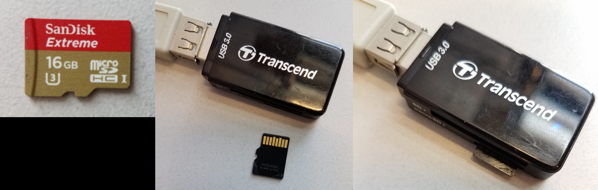
1. Insert the uSD card into the uSD card slot on ODROID-XU4 chip.
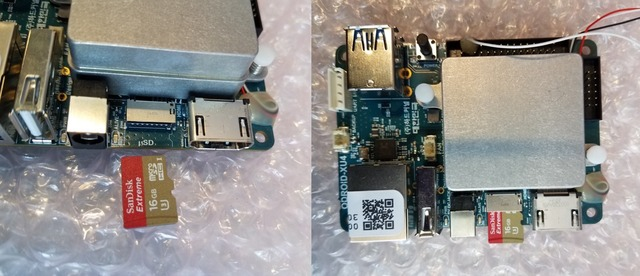
1. Line up the pins on the red Hardkernel eMMC card with the blue MicroSD eMMC Reader chip.
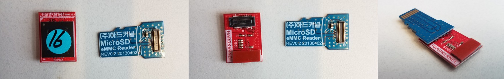
1. Insert the MicroSD eMMC Reader into the SD card adapter.
1. Select 'Make EP eMMC' on desktop.
1. After the terminal indicates the process is complete, remove the Hardkernel eMMC card and MicroSD eMMC Reader from the SD card adapter.
1. Snapfit the Hardkernel eMMC card to the back of ODROID-XU4 chip.
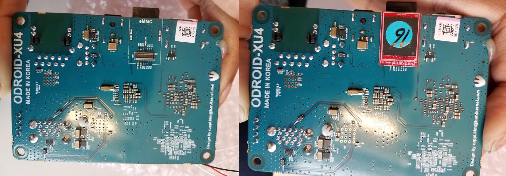

**Step 2.**
1. Connect the network cable to ODROID-XU4 chip.
1. Connect 2 USB cables to stacked USB port on ODROID-XU4 chip.
1. Connect XU-4 cable to ODROID-XU4 chip.

1. Select 'Component Test EP' on desktop.
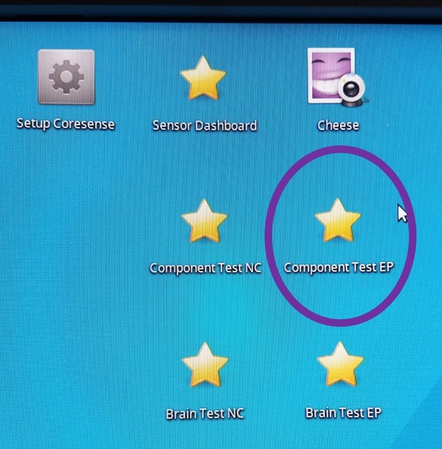
1. Select 'Clear Reports' on Test Report: ep page.
1. Check that screen reads 'ep reports cleared. X seconds ago.'.
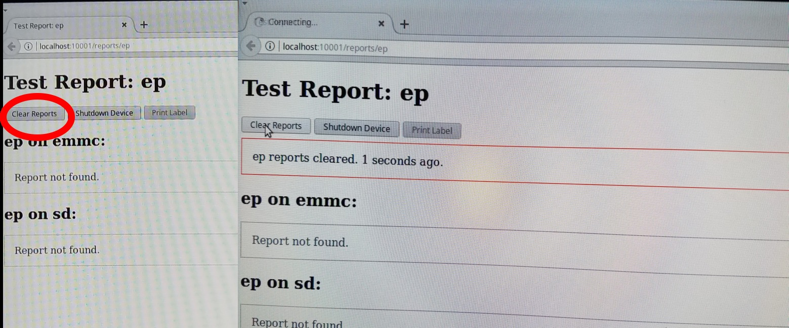
1. Locate black, red and white wire trio on ODROID-XU4 chip.
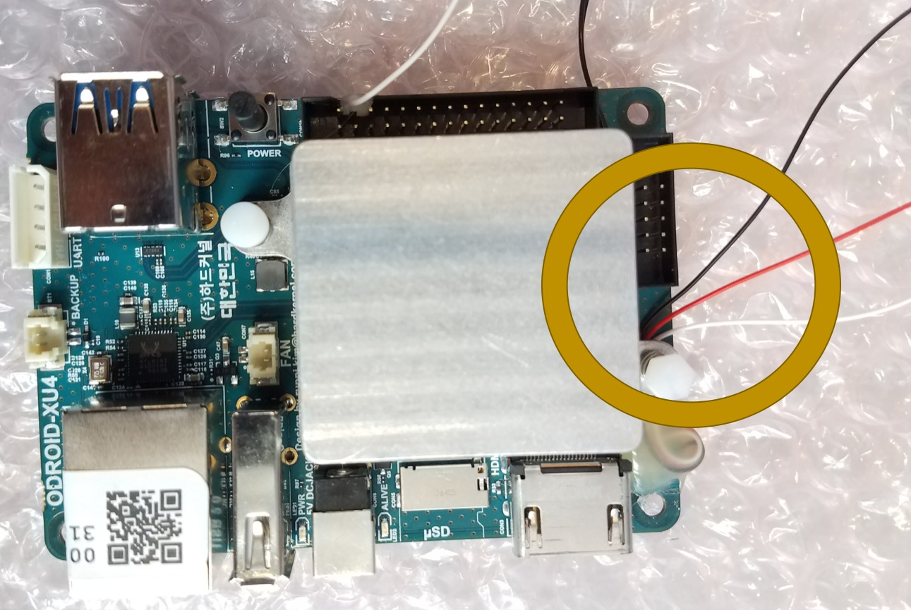
1. Short black and white wires securely with wire-short device.
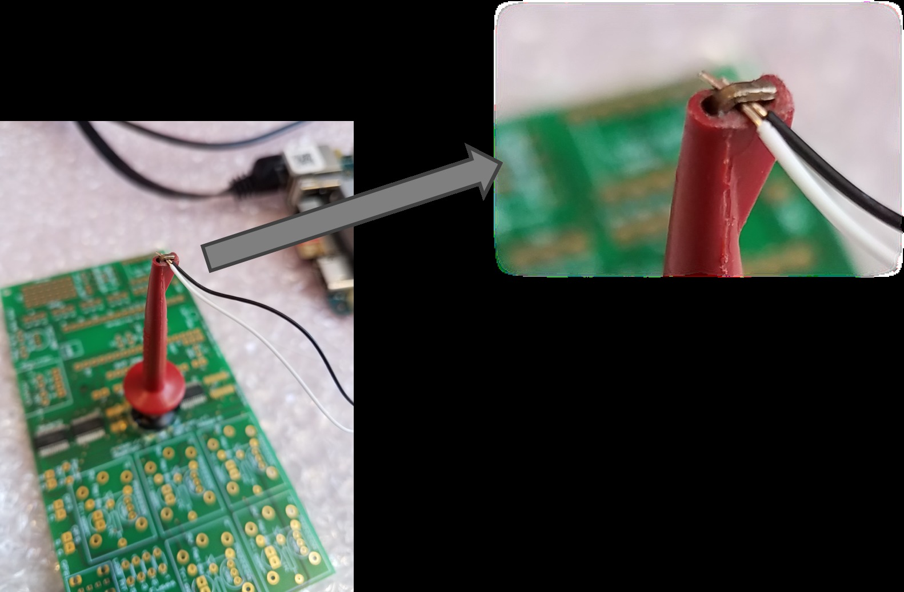

***
### **NOTE: Never short red and black wires, doing so will damage the system.**
***

9. Connect barrel power cable to ODROID-XU4 chip.
1. Within 30 seconds, screen should read 'ODROID on xu4 powered up. X seconds ago.'.
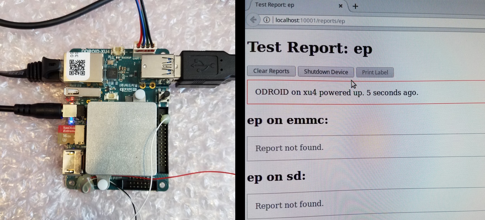
1. Check that the blue LED, in addition to the red LED, lights up on ODRIOID-XU4 chip.
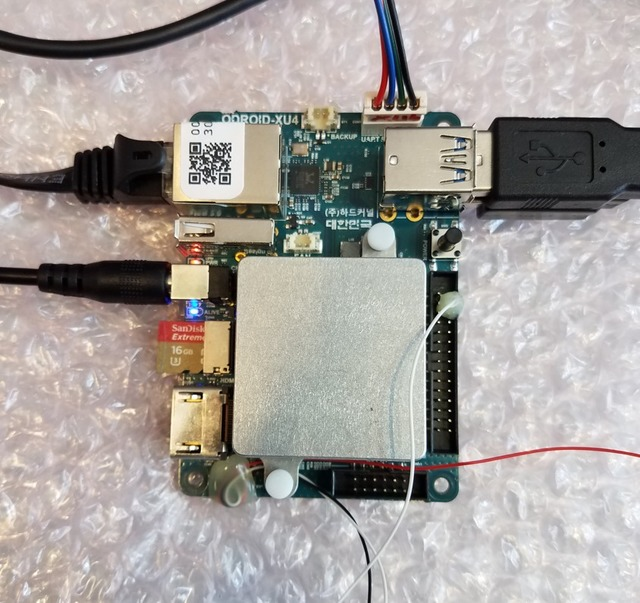
1. Check that blue LED blinks periodically on XU4 cable.
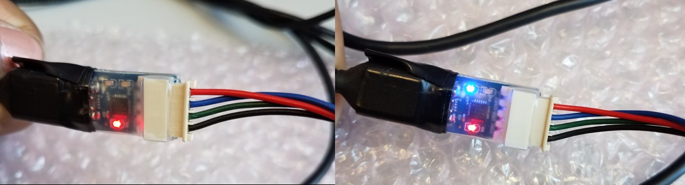
1. Within 30 seconds, screen should read 'Starting ep stress test. X seconds ago.'.

***
### **CAUTION: Heat sink temperature increases sigificantly during stress test. Avoid touching heat sink to prevent burns.**
***

14. After stress test is complete, ep on sd test report will be generated.
1. Check that test yields one red box that reads 'usb ready - 2 devices detected' and the remainder are green boxes.
1. Connect a third USB cable to ODROID-XU4 chip.
1. After 30 seconds, check that red box is now green and reads 'usb ready - 3 devices detected'.
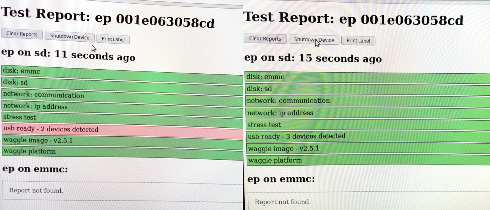

**Step 3.**
1. Select the 'Shutdown Device' button.
1. Check that the screen reads 'ODROID on xu4 shutdown gracefully. X seconds ago.'.
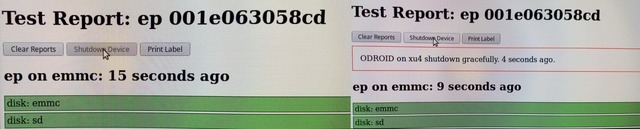
1. Disconnect barrel power cable from ODROID-XU4 chip.
1. Remove the black and white wires from the wire-short device.
1. Short red and white wires securely with wire-short device.
1. Connect barrel power cable to ODROID-XU4 chip.
1. Check that screen reads 'ODROID on xu4 powered up. X seconds ago.'.
1. ep on emmc test results should be generated shortly.
1. Check that all boxes from test results are green.
1. Remove one USB cable from ODROID-XU4 chip.
1. Check that after screen updates, a red box appears that reads 'usb ready - 2 devices detected'.
1. Select 'Shutdown Device' button.
1. Check that screen reads 'ODROID on xu4 shutdown gracefully. X seconds ago.'.
1. Remove barrel power cable from ODROID-XU4 chip.
1. Remove red and white wires from wire-short device.
1. Diconnect all cables (i.e., USB cables, network cable, XU4 cable) from ODROID-XU4 chip.
1. Mark device operable. Otherwise, if unable to complete each of the steps in entirety, mark device inoperable.

## ***Test Procedure Node Control (ODROID-C1+)***

**Step 1.**
1. 1. Configure 16 GB uSD Card by inserting into SD card adapter.
1. Select 'Make NC SD' on desktop.
1. After the terminal indicates the process is complete, remove uSD card.
1. Insert the uSD card into the uSD card slot on ODROID-C1+ chip.
1. Line up the pins on the black Hardkernel eMMC card with the blue MicroSD eMMC Reader chip.
1. Insert the MicroSD eMMC Reader into the SD card adapter.
1. Select 'Make NC eMMC' on desktop.
1. After the terminal indicates the process is complete, remove the Hardkernel eMMC card and MicroSD eMMC Reader from the SD card adapter.
1. Snapfit the Hardkernel eMMC card to the back of ODROID-C1+ chip.
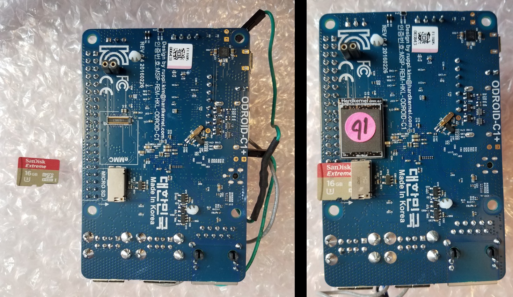

**Step 2.**
1. Connect the network cable to ODROID-C1+ chip.
1. Connect 3 USB cables to stacked USB port on ODROID-C1+ chip.

1. Connect C1+ cable to ODROID-C1+ chip.
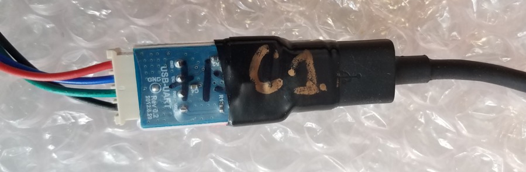
1. Select 'Component Test NC' on desktop.
1. Select 'Clear Reports' on Test Report: nc page.
1. Check that screen reads 'nc reports cleared. X seconds ago.'.
1. Connect barrel power cable to ODROID-C1+ chip.
1. Within 30 seconds, screen should read 'ODROID on c1 powered up. X seconds ago.'.
1. Check that the blue LED, in addition to the red LED, lights up on ODRIOID-C1+ chip.
1. Check that blue LED blinks periodically on C1+ cable.
1. Within 30 seconds, screen should read 'Starting nc stress test. X seconds ago.'.

***
### **CAUTION: Heat sink temperature may increase sigificantly during stress test. Avoid touching heat sink to prevent burns.**
***

12. After stress test is complete, nc on sd test report will be generated.
1. Check that test yields one red box that reads 'usb ready - 3 devices detected' and the remainder are green boxes.
1. Connect a fourth USB cable to ODROID-C1+ chip.
1. After 30 seconds, check that red box is now green and reads 'usb ready - 4 devices detected'.

**Step 3.**
1. Select the 'Shutdown Device' button.
1. Check that the screen reads 'ODROID on c1 shutdown gracefully. X seconds ago.'.
1. Disconnect barrel power cable from ODROID-C1+ chip.
1. Reconnect barrel power cable to ODROID-C1+ chip.
1. Check that screen reads 'ODROID on c1 powered up. X seconds ago.'.
1. nc on emmc test results should be generated shortly.
1. Check that all boxes from test results are green.
1. Remove one USB cable from ODROID-C1+ chip.
1. Check that after screen updates, a red box appears that reads 'usb ready - 3 devices detected'.
1. Select 'Shutdown Device' button.
1. Check that screen reads 'ODROID on c1 shutdown gracefully. X seconds ago.'.
1. Remove barrel power cable from ODROID-C1+ chip.
1. Diconnect all cables (i.e., USB cables, network cable, C1+ cable) from ODROID-C1+ chip.
1. Mark device operable. Otherwise, if unable to complete each of the steps in entirety, mark device inoperable.
