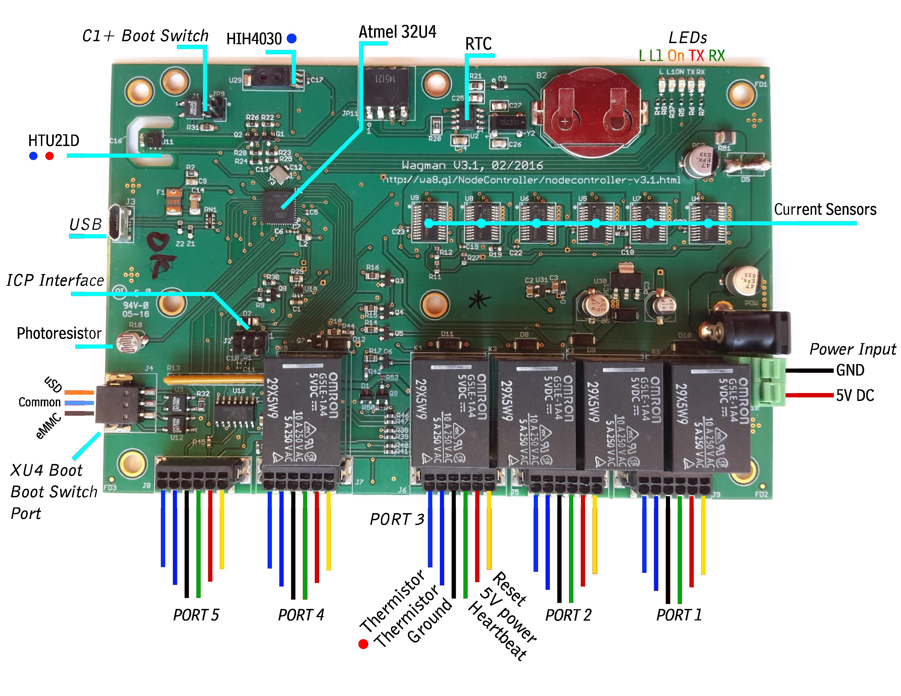

# WagMan Layout and Features

The WagMan V3.1 board is capable of managing upto 5 devices through power control, power monitoring, 
heartbeat monitoring and device temperature monitoring. The figure below shows a WagMan with annotations 
pointing out to the various capabilities, sensors and connectors on board. 

## Onboard Sensors

The WagMan V3.1 board has a set of on-board sensors that include
  * HT21D - Digital Temperature and Humidity Sensor
  * HIH4030 - Analog Humidity Sensor
  * ACS764 Current Sensors
  * Thermistors for sensing temperature of connected devices
  * An Opto-resistor to provide a measure of brightness in the vicinity of the WagMan. 

## Time Keeping and Unique ID

In addition to the above sensors, the WagMan can keep time using a real-time clock chip - MCP79412, 
which also provides the WagMan with a 6-byte unique ID. 

## Power Distribution, Control and Metering
There are 5 current sensed switched output ports on the WagMan numbered Port 1 to 5 with the following features

  * Each port has one 5V power output, one Thermistor input (2 pins) and one heartbeat input. An optional 
  reset pin can be used to reset a device (by toggling the line) powered by an external source. The reset 
  feature and 5V power cannot be used at the same time on a port. 
  * Port 1 is uniquely configured to maintain power state across Atmel 32U4 resets. This port is reserved for the 
  Node Controller.
  * The 5 output ports, Port 1 to Port 5, are uniquely configured on V3.1 board as follows 
   * Port 1: Reserved for a C1+ based Node Controller. The heart-beat lines are are designed to accomodate 3.3V logic. 
   * Port 2: Reserved for a XU4 based Guest Module. The heart-beat lines are designed to accomodate 1.8V logic. 
   * Port 3,4,5: Can be connected to any device that takes 5V power, consumes less than 2.5A of current and can support 5V logic for heartbeat and reset lines. 

## Odroid Specific Features

The WagMan is configured to be able to support boot media switch on two connected Odroid single board computers as follows
  * __C1+ Boot Switch__: This is a two pin connector that is bridged in the default state to choose uSD as the default boot 
  media of the C1+ Node Controller. The two pins can be disconnected by the Atmel 32U4 Processor to choose the eMMC boot media. 
  * __XU4 Boot Switch__: This is a three pin connector where the center pin (PIN 2) can be bridged to either the right (PIN 1) 
  or left (PIN 3) pins. The default state bridges PIN 1 and PIN 2, with PIN 3 isolated to choose uSD boot media on the connected XU4, and the 
  Atmel 32U4 processor can bridge PIN 2 and PIN 3, isolating PIN 1 to choose eMMC boot media. 

## Feedback LEDs
The WagMan board has 5 status LEDs with the following features
  * A On LED stays on if the board is receiving 5V DC power. 
  * RX LED that blinks to signify input of data through the USB port to the board. 
  * TX LED that blinks to signify output of data from the board through the USB port. 
  * LEDs L and L1 - These can be brightness controlled (connected to PWM port) by the Atmel 32U4 to provide state information.

## Inputs and Outputs
 The WagMan board has several power and communication Inputs and Outputs as listed below
 
 * Power
  * Power Input - 5V, 10A max. 
  * 5 Power Outputs - 5V, 2.5A max.

 * Communication
  * USB Interface - USB CDC communication port to connect to Node Controller
  * ISP Interface - For loading Bootloader on Atmel 32U4 using AVRISP MkII programmer. Post boot-loader flashing phase, the SRE V1 board is connected to this port for enabling Atmel 32U4 reset by Node Controller. 

 * Health Status
  * Heart-beat inputs - five ports that can sense a heartbeat signal represented by toggle between GND and Logic high.

 * Sensor
  * Thermistor inputs - five inputs to sense temperature

 * Control 
  * Reset outputs - five lines for devices that can be reset by toggling the line. The lines assume 5V logic high or GND, and 
    cannot be used simultaneously with power delivery from a port.  

