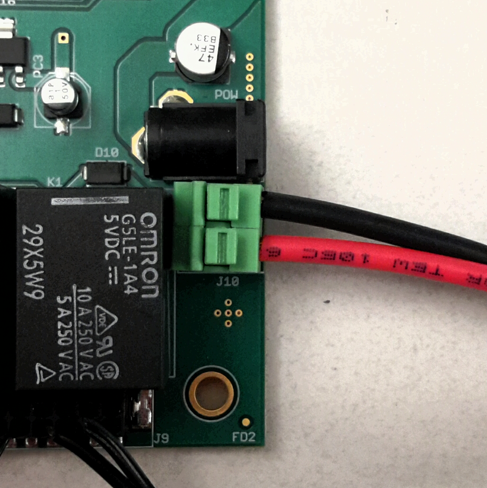
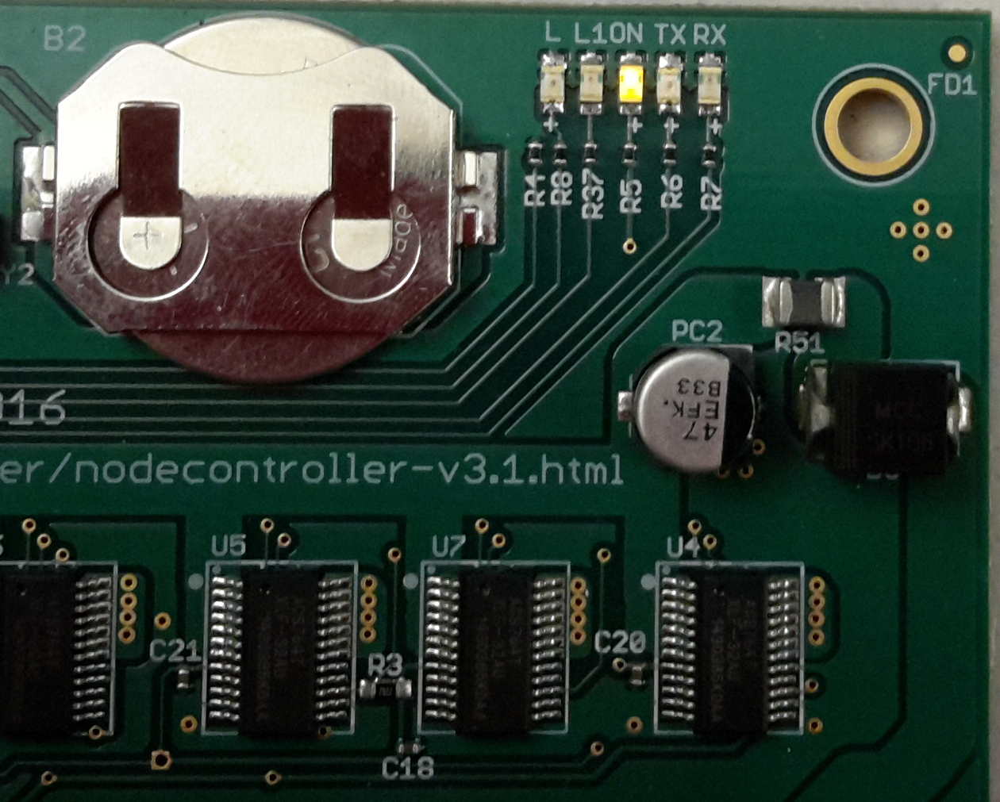
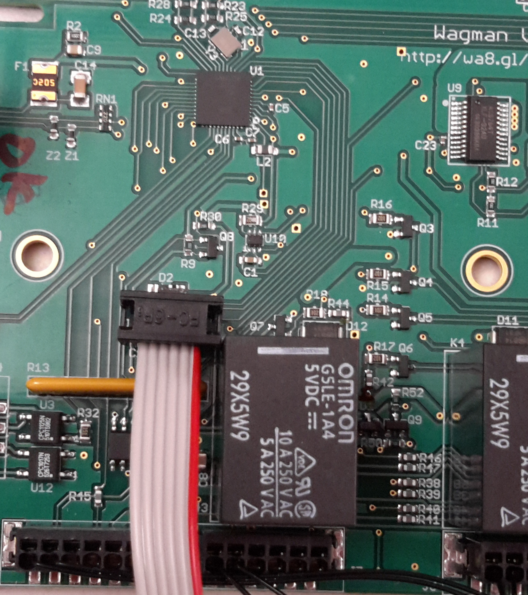
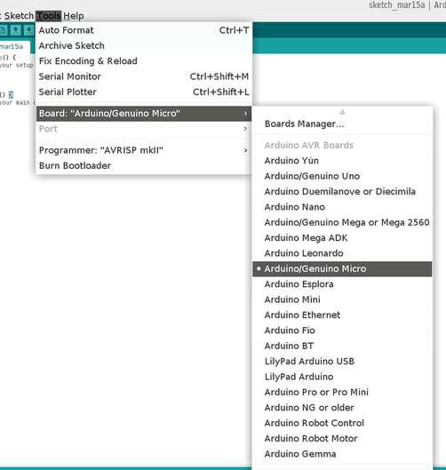

## Testing Procedure
*   Power on Wagman by connecting the 5V DC power as shown in figure below. Red is +5V and Black is ground.  

*   Check if the Yellow "ON" LED lights up. The L and L1 debug LEDs are to the left of the ON LED.  

*   Connect the Atmel AVRISP mkII to the QA computer and connect it to J2 of
    Wagman as shown below.  

*   Program the Arduino bootloader for Arduino micro board.
    - On the Arduino GUI (Version 1.6.7), choose the Arduino Micro board.  

    - Choose the AVRISP mkII programmer.  

    - Burn the bootloader.  

*   On completion of the above step, connect the board to the QA computer using a micro-USB cable.
    __Please make sure only the Wagman under test is connected to the QA computer. No other Wagman or
    Arduino Micro/derivatives can be connected at this time.__

*   Initialize the Wagman by issuing the command *make initialize* in the Wagman subfolder
    and follow the on-screen prompts.
